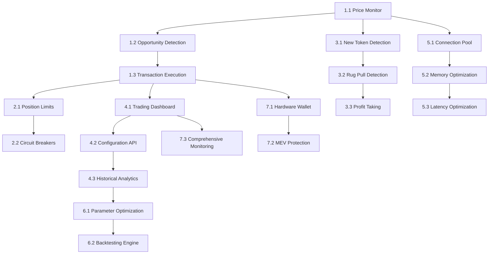

# Solana Arbitrage Bot - Development Stories

## Epic 1: Core Arbitrage Engine

### Story 1.1: Multi-DEX Price Monitor
**As a** trader  
**I want** real-time price monitoring across multiple DEXs  
**So that** I can identify arbitrage opportunities quickly

**Acceptance Criteria:**
- [x] WebSocket connections to Raydium, Orca, Jupiter APIs
- [x] Price updates processed with <100ms latency
- [x] Thread-safe price storage with concurrent access
- [x] Connection failure handling with automatic reconnection
- [x] Price history buffer (last 100 updates per pair)

**Technical Details:**
- **Files**: `src/monitor.rs`, `src/dex/mod.rs`
- **Dependencies**: `tokio-tungstenite`, `serde_json`, `dashmap`
- **Configuration**: DEX endpoints in `config.yaml`
- **Tests**: WebSocket connection tests, price parsing validation

**Implementation Notes:**
```rust
struct PriceMonitor {
    connections: HashMap<DexId, WebSocketStream>,
    price_cache: Arc<DashMap<TradingPair, PriceData>>,
    event_sender: mpsc::Sender<PriceUpdate>,
}
```

### Story 1.2: Arbitrage Opportunity Detection
**As a** trader  
**I want** automatic detection of profitable arbitrage opportunities  
**So that** I can capitalize on price differences between DEXs

**Acceptance Criteria:**
- [ ] Calculate spread between DEX prices for same trading pair
- [ ] Account for gas costs and slippage in profit calculation
- [ ] Filter opportunities below minimum profit threshold (0.3%)
- [ ] Rank opportunities by profit potential
- [ ] Emit trading signals for qualified opportunities

**Technical Details:**
- **Files**: `src/calculator.rs`, `src/strategies/arbitrage.rs`
- **Dependencies**: `rust_decimal`, `statrs`
- **Configuration**: Min profit, slippage tolerance, gas estimates
- **Tests**: Profit calculation edge cases, threshold filtering

**Implementation Notes:**
```rust
#[derive(Debug, Clone)]
struct ArbitrageOpportunity {
    pair: TradingPair,
    buy_dex: DexId,
    sell_dex: DexId,
    spread_percent: Decimal,
    estimated_profit_usd: Decimal,
    confidence_score: f64,
}
```

### Story 1.3: Transaction Execution Engine
**As a** trader  
**I want** automated transaction execution for arbitrage opportunities  
**So that** I can capture profits without manual intervention

**Acceptance Criteria:**
- [ ] Build atomic swap transactions (buy + sell)
- [ ] Simulate transaction before execution
- [ ] Execute with optimal priority fees
- [ ] Handle transaction failures gracefully
- [ ] Confirm execution and calculate actual profit

**Technical Details:**
- **Files**: `src/executor.rs`, `src/transaction_builder.rs`
- **Dependencies**: `solana-client`, `solana-sdk`, `anchor-client`
- **Configuration**: RPC endpoints, wallet keypair, priority fee strategy
- **Tests**: Transaction simulation, execution flow, error handling

**Implementation Notes:**
```rust
struct TransactionExecutor {
    rpc_client: Arc<RpcClient>,
    wallet: Keypair,
    priority_fee_strategy: PriorityFeeStrategy,
}
```

## Epic 2: Risk Management and Safety

### Story 2.1: Position Size Limits
**As a** risk manager  
**I want** configurable position size limits  
**So that** individual trades cannot exceed risk tolerance

**Acceptance Criteria:**
- [ ] Maximum SOL amount per trade
- [ ] Maximum USD value per trade  
- [ ] Maximum percentage of portfolio per trade
- [ ] Dynamic position sizing based on volatility
- [ ] Override capabilities for manual intervention

**Technical Details:**
- **Files**: `src/safety.rs`, `src/risk_manager.rs`
- **Dependencies**: `rust_decimal`
- **Configuration**: Position limits in trading config
- **Tests**: Limit enforcement, edge cases, override scenarios

### Story 2.2: Circuit Breakers
**As a** risk manager  
**I want** automatic trading halts during anomalous conditions  
**So that** the bot stops trading when markets behave unexpectedly

**Acceptance Criteria:**
- [ ] Halt trading after consecutive failed trades (configurable threshold)
- [ ] Stop on daily loss limit exceeded
- [ ] Detect unusual price volatility and pause
- [ ] Manual emergency stop capability
- [ ] Automatic resume after conditions normalize

**Technical Details:**
- **Files**: `src/safety.rs`, `src/circuit_breaker.rs`
- **Dependencies**: None (core Rust)
- **Configuration**: Thresholds and timeout durations
- **Tests**: Trigger conditions, recovery scenarios

### Story 2.3: Real-time Safety Monitoring
**As a** trader  
**I want** continuous monitoring of safety metrics  
**So that** I can observe risk levels and system health

**Acceptance Criteria:**
- [ ] Track current positions and exposure
- [ ] Monitor daily P&L and drawdown
- [ ] Display safety metric dashboard
- [ ] Alert system for threshold breaches
- [ ] Historical safety metric trends

**Technical Details:**
- **Files**: `src/web/handlers.rs`, `src/monitoring.rs`
- **Dependencies**: `serde_json`, `chrono`
- **Configuration**: Alert thresholds and notification channels
- **Tests**: Metric calculation accuracy, alert triggering

## Epic 3: Advanced Sniping Features

### Story 3.1: New Token Detection
**As a** sniper trader  
**I want** real-time detection of new token launches  
**So that** I can be first to trade newly listed tokens

**Acceptance Criteria:**
- [ ] Monitor Pump.fun for new token launches
- [ ] Detect new Raydium/Orca pool creation events
- [ ] Parse token metadata and initial liquidity
- [ ] Filter tokens by minimum criteria (liquidity, holder count)
- [ ] Emit new token signals with scoring

**Technical Details:**
- **Files**: `src/sniper/detector.rs`, `src/sniper/monitor.rs`
- **Dependencies**: `solana-client`, `anchor-client`
- **Configuration**: Token filter criteria, monitoring endpoints
- **Tests**: Event parsing, filtering logic, signal generation

### Story 3.2: Rug Pull Detection
**As a** sniper trader  
**I want** automated rug pull risk assessment  
**So that** I can avoid scam tokens and protect my capital

**Acceptance Criteria:**
- [ ] Analyze token holder distribution
- [ ] Check liquidity lock status and duration
- [ ] Verify social media presence and activity
- [ ] Calculate composite safety score (0-1)
- [ ] Block trades below safety threshold

**Technical Details:**
- **Files**: `src/sniper/rug_detector.rs`, `src/sniper/safety.rs`
- **Dependencies**: `reqwest`, `serde_json`
- **Configuration**: Safety score thresholds, analysis weights
- **Tests**: Score calculation, threshold enforcement

### Story 3.3: Automated Profit Taking
**As a** sniper trader  
**I want** automated sell logic for sniped positions  
**So that** I can lock in profits without manual monitoring

**Acceptance Criteria:**
- [ ] Trailing stop-loss functionality
- [ ] Multiple profit-taking levels (25%, 50%, 75%, 100% profit)
- [ ] Time-based exit strategies (hold for X minutes)
- [ ] Volume-based exit (low volume triggers sell)
- [ ] Manual override and position management

**Technical Details:**
- **Files**: `src/sniper/profit_taker.rs`, `src/sniper/position.rs`
- **Dependencies**: `tokio`, `chrono`
- **Configuration**: Profit targets, stop-loss percentages
- **Tests**: Profit-taking logic, edge cases, timing scenarios

## Epic 4: Web Dashboard and API

### Story 4.1: Real-time Trading Dashboard
**As a** trader  
**I want** a web dashboard showing current trading status  
**So that** I can monitor bot performance visually

**Acceptance Criteria:**
- [ ] Real-time P&L display with charts
- [ ] Active positions and recent trades table
- [ ] Current opportunities and market overview
- [ ] System health indicators
- [ ] Responsive design for desktop and mobile

**Technical Details:**
- **Files**: `dashboard-frontend/src/`, `src/web/handlers.rs`
- **Dependencies**: `axum`, `tower-http`, Next.js, React
- **Configuration**: Web server port, authentication tokens
- **Tests**: API endpoint tests, UI component tests

### Story 4.2: Configuration Management API
**As a** trader  
**I want** ability to modify bot configuration through web interface  
**So that** I can adjust parameters without restarting the bot

**Acceptance Criteria:**
- [ ] REST API for reading current configuration
- [ ] Endpoint for updating trading parameters
- [ ] Configuration validation and error handling
- [ ] Configuration backup and restore
- [ ] Audit trail for configuration changes

**Technical Details:**
- **Files**: `src/web/handlers.rs`, `src/config_manager.rs`
- **Dependencies**: `axum`, `serde`
- **Configuration**: API authentication, allowed parameters
- **Tests**: Configuration validation, API security

### Story 4.3: Historical Analytics
**As a** trader  
**I want** detailed analytics of past trading performance  
**So that** I can understand profitability patterns and optimize strategies

**Acceptance Criteria:**
- [ ] Daily/weekly/monthly P&L reports
- [ ] Trade success rate and average profit per trade
- [ ] Performance by trading pair and strategy
- [ ] Drawdown analysis and risk metrics
- [ ] Export functionality for external analysis

**Technical Details:**
- **Files**: `src/web/analytics.rs`, `src/web/database.rs`
- **Dependencies**: `sqlx`, `chrono`, `serde_json`
- **Configuration**: Database connection, retention periods
- **Tests**: Analytics calculation accuracy, data consistency

## Epic 5: Performance Optimization

### Story 5.1: Connection Pool Management
**As a** system administrator  
**I want** efficient RPC connection management  
**So that** the bot can handle high-frequency operations reliably

**Acceptance Criteria:**
- [ ] Connection pool for RPC clients with configurable size
- [ ] Automatic connection health checking
- [ ] Load balancing across multiple RPC endpoints
- [ ] Connection retry logic with exponential backoff
- [ ] Metrics for connection pool utilization

**Technical Details:**
- **Files**: `src/performance/connection_pool.rs`
- **Dependencies**: `tokio`, `tower`, `hyper`
- **Configuration**: Pool size, health check intervals, timeout values
- **Tests**: Pool behavior under load, failover scenarios

### Story 5.2: Memory and CPU Optimization
**As a** system administrator  
**I want** optimized resource usage  
**So that** the bot can run efficiently on minimal hardware

**Acceptance Criteria:**
- [ ] Memory usage monitoring and optimization
- [ ] CPU profiling and hotspot identification
- [ ] Garbage collection tuning for long-running processes
- [ ] Memory leak detection and prevention
- [ ] Resource usage alerts and auto-scaling

**Technical Details:**
- **Files**: `src/performance/profiling.rs`, `src/monitoring.rs`
- **Dependencies**: `pprof`, `sysinfo`
- **Configuration**: Resource thresholds, monitoring intervals
- **Tests**: Performance benchmarks, resource leak tests

### Story 5.3: Latency Optimization
**As a** trader  
**I want** minimal latency from opportunity detection to execution  
**So that** I can compete effectively with other trading bots

**Acceptance Criteria:**
- [x] End-to-end latency measurement and tracking
- [x] Optimization of critical path operations
- [x] Parallel processing where possible
- [x] Network latency optimization (connection locality)
- [x] Latency alerting for performance degradation

**Technical Details:**
- **Files**: `src/performance/latency.rs`, `src/metrics.rs`
- **Dependencies**: `tracing`, `prometheus`
- **Configuration**: Latency targets, measurement points
- **Tests**: Latency benchmarks, performance regression tests

## Epic 6: Genetic Algorithm Optimization (GEPA)

### Story 6.1: Parameter Optimization Framework
**As a** algorithmic trader  
**I want** automatic optimization of trading parameters  
**So that** the bot can adapt to changing market conditions

**Acceptance Criteria:**
- [ ] Genetic algorithm implementation for parameter tuning
- [ ] Fitness function based on risk-adjusted returns
- [ ] Population management and evolution cycles
- [ ] Parameter bounds and constraints enforcement
- [ ] Optimization history and convergence tracking

**Technical Details:**
- **Files**: `src/gepa/optimizer.rs`, `src/gepa/evolution.rs`
- **Dependencies**: `rand`, `nalgebra`
- **Configuration**: Population size, mutation rates, evolution cycles
- **Tests**: Algorithm convergence, parameter validation

### Story 6.2: Backtesting Engine
**As a** algorithmic trader  
**I want** historical backtesting of optimized parameters  
**So that** I can validate strategy performance before live deployment

**Acceptance Criteria:**
- [ ] Historical price data ingestion and storage
- [ ] Backtesting engine with realistic execution simulation
- [ ] Performance metrics calculation (Sharpe ratio, max drawdown)
- [ ] A/B testing framework for parameter comparison
- [ ] Backtesting report generation and visualization

**Technical Details:**
- **Files**: `src/backtesting/engine.rs`, `src/backtesting/metrics.rs`
- **Dependencies**: `chrono`, `statrs`, `plotters`
- **Configuration**: Historical data sources, backtesting periods
- **Tests**: Backtesting accuracy, metric calculations

## Epic 7: Security and Monitoring

### Story 7.1: Hardware Wallet Integration
**As a** security-conscious trader  
**I want** hardware wallet support for transaction signing  
**So that** my private keys remain secure

**Acceptance Criteria:**
- [ ] Ledger hardware wallet integration
- [ ] Transaction review and approval workflow
- [ ] Secure key derivation and management
- [ ] Fallback to software wallet if hardware unavailable
- [ ] Multi-signature wallet support

**Technical Details:**
- **Files**: `src/ledger.rs`, `src/security/wallet_manager.rs`
- **Dependencies**: `ledger-transport`, `solana-ledger`
- **Configuration**: Derivation paths, approval timeouts
- **Tests**: Hardware wallet simulation, security workflows

### Story 7.2: MEV Protection
**As a** trader  
**I want** protection against MEV attacks  
**So that** my profitable trades aren't front-run by other bots

**Acceptance Criteria:**
- [ ] Jito bundle integration for private mempool submission
- [ ] Transaction bundling for atomic execution
- [ ] Dynamic priority fee calculation
- [ ] MEV attack detection and reporting
- [ ] Alternative routing when MEV protection unavailable

**Technical Details:**
- **Files**: `src/security/mev_protection.rs`
- **Dependencies**: `jito-client`, `solana-sdk`
- **Configuration**: Bundle settings, priority fee strategies
- **Tests**: Bundle creation, MEV detection scenarios

### Story 7.3: Comprehensive Monitoring
**As a** system administrator  
**I want** comprehensive monitoring and alerting  
**So that** I can maintain system reliability and performance

**Acceptance Criteria:**
- [ ] Prometheus metrics integration
- [ ] Grafana dashboard templates
- [ ] Telegram/Discord alert notifications
- [ ] Log aggregation and analysis
- [ ] Health check endpoints for external monitoring

**Technical Details:**
- **Files**: `src/monitoring/prometheus.rs`, `src/notifications/`
- **Dependencies**: `prometheus`, `reqwest`
- **Configuration**: Metric retention, alert thresholds, webhook URLs
- **Tests**: Metric collection, alert delivery

## Story Implementation Template

For each story, developers should follow this implementation checklist:

### Pre-Implementation
- [ ] Review story acceptance criteria
- [ ] Design API interfaces and data structures  
- [ ] Plan test scenarios and edge cases
- [ ] Identify configuration requirements
- [ ] Review security implications

### Implementation
- [ ] Write failing tests first (TDD approach)
- [ ] Implement core functionality
- [ ] Add error handling and logging
- [ ] Implement configuration support
- [ ] Add performance instrumentation

### Testing
- [ ] Unit tests with >90% coverage
- [ ] Integration tests for external dependencies
- [ ] Performance benchmarks where applicable
- [ ] Security testing for sensitive operations
- [ ] Documentation updates

### Review and Deployment
- [ ] Code review by team member
- [ ] Manual testing of happy path and edge cases
- [ ] Update CLAUDE.md if architecture changes
- [ ] Deploy to staging environment
- [ ] Validate in production-like conditions

## Story Dependencies



This dependency graph helps prioritize story implementation and identify parallel development opportunities.