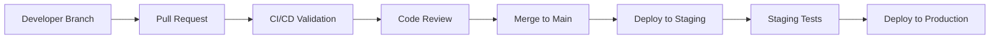

# Solana Arbitrage Bot - Team Workflows and Processes

## 🎯 BMAD Method Workflow Implementation

This document defines the development workflows based on BMAD Method principles for the Solana Arbitrage Bot project.

## 👥 Team Roles and Responsibilities

### Analyst Agent Role
**Responsibility**: Requirements analysis and market research
- Monitors DeFi market trends and trading opportunities
- Analyzes competitor bot strategies and features
- Defines acceptance criteria for trading features
- Validates business value of proposed implementations

### Product Manager (PM) Agent Role  
**Responsibility**: Feature prioritization and roadmap management
- Maintains product backlog and sprint planning
- Balances technical debt vs new feature development
- Coordinates between stakeholders and development team
- Tracks success metrics and KPIs

### Architect Agent Role
**Responsibility**: Technical architecture and system design
- Designs scalable and maintainable system architecture
- Reviews technical feasibility of product requirements
- Establishes coding standards and best practices
- Guides technology stack decisions

### Scrum Master Agent Role
**Responsibility**: Process facilitation and story creation
- Transforms requirements into detailed development stories
- Facilitates sprint planning and retrospectives
- Removes blockers and ensures team productivity
- Maintains development velocity metrics

### Developer Agent Role
**Responsibility**: Implementation and code delivery
- Implements features according to detailed stories
- Writes comprehensive tests and documentation
- Performs code reviews and maintains quality
- Deploys and monitors production systems

## 🔄 Development Lifecycle

### Phase 1: Requirements Gathering (Analyst + PM)

#### Weekly Market Analysis
- **Schedule**: Every Monday 9:00 AM
- **Participants**: Analyst Agent, PM Agent
- **Duration**: 60 minutes
- **Deliverables**:
  - Market opportunity analysis
  - Competitor feature comparison
  - User feedback synthesis
  - Priority recommendations

#### Quarterly Product Planning
- **Schedule**: First week of each quarter
- **Participants**: All agents
- **Duration**: 4 hours (distributed across week)
- **Deliverables**:
  - Updated product roadmap
  - Resource allocation plan
  - Success metrics definition
  - Risk assessment update

### Phase 2: Architecture Design (Architect)

#### Technical Design Review
- **Trigger**: New epic or major feature
- **Participants**: Architect Agent, Senior Developers
- **Duration**: 2 hours
- **Deliverables**:
  - Technical design document
  - API specifications
  - Database schema changes
  - Performance impact analysis

#### Architecture Decision Records (ADRs)
```markdown
# ADR-001: Feature Flag Architecture

## Status
Accepted

## Context
Need modular compilation for different deployment scenarios

## Decision
Use Rust feature flags for component modularity

## Consequences
- Positive: Smaller production binaries
- Negative: Increased build complexity
```

### Phase 3: Story Creation (Scrum Master)

#### Story Writing Template
```markdown
## User Story
**As a** [user type]  
**I want** [functionality]  
**So that** [business value]

## Acceptance Criteria
- [ ] Specific, testable criteria
- [ ] Edge cases covered
- [ ] Performance requirements
- [ ] Security considerations

## Technical Details
- **Files**: Affected source files
- **Dependencies**: New or updated dependencies
- **Configuration**: Required config changes
- **Tests**: Test scenarios and coverage

## Definition of Done
- [ ] Code implemented and reviewed
- [ ] Unit tests written (>90% coverage)
- [ ] Integration tests passing
- [ ] Documentation updated
- [ ] Deployed to staging
- [ ] Performance benchmarks met
```

#### Sprint Planning Process
1. **Story Estimation**: Planning poker with Fibonacci scale
2. **Capacity Planning**: Account for holidays, meetings, and maintenance
3. **Dependency Mapping**: Identify cross-story dependencies
4. **Risk Assessment**: Flag high-risk stories for early attention

### Phase 4: Implementation (Developer)

#### Daily Development Workflow
```bash
# 1. Update local development environment
git pull origin main
cargo update

# 2. Create feature branch
git checkout -b feature/arbitrage-latency-optimization

# 3. Test-Driven Development cycle
cargo test --no-default-features --features monitor -- --nocapture

# 4. Implementation with regular commits
git add -A
git commit -m "feat: implement connection pooling for RPC clients"

# 5. Pre-merge quality checks
cargo fmt --all -- --check
cargo clippy --no-default-features --features monitor --all-targets -- -D warnings

# 6. Create pull request with template
```

#### Pull Request Template
```markdown
## Summary
Brief description of changes and motivation

## Changes Made
- [ ] Feature implementation
- [ ] Bug fixes
- [ ] Documentation updates
- [ ] Test additions

## Testing
- [ ] Unit tests added/updated
- [ ] Integration tests passing  
- [ ] Manual testing completed
- [ ] Performance impact assessed

## Checklist
- [ ] Code follows project style guide
- [ ] Self-review completed
- [ ] Documentation updated
- [ ] Breaking changes documented
```

## 📊 Quality Assurance Process

### Code Review Standards

#### Required Reviewers
- **Core Changes**: 2 reviewers (1 architect + 1 senior dev)
- **Feature Changes**: 1 reviewer (any senior dev)
- **Documentation**: 1 reviewer (any team member)
- **Critical Security**: 2 reviewers (must include security expert)

#### Review Checklist
```markdown
- [ ] Code follows Rust best practices
- [ ] Tests provide adequate coverage
- [ ] Documentation is clear and complete
- [ ] Performance impact is acceptable
- [ ] Security implications considered
- [ ] Error handling is comprehensive
- [ ] Configuration changes documented
```

### Automated Quality Gates

#### CI/CD Pipeline Stages
1. **Build Validation**
   ```bash
   cargo build --release --no-default-features --features monitor
   ```

2. **Code Quality**
   ```bash
   cargo fmt --all -- --check
   cargo clippy --no-default-features --features monitor --all-targets -- -D warnings
   ```

3. **Test Execution**
   ```bash
   cargo test --no-default-features --features monitor --workspace --verbose
   ```

4. **Security Audit**
   ```bash
   cargo audit
   ```

5. **Performance Benchmarks**
   ```bash
   cargo bench --no-default-features --features monitor
   ```

## 🚀 Deployment Process

### Environment Promotion Pipeline



### Deployment Checklist

#### Pre-Deployment
- [ ] All tests passing in CI/CD
- [ ] Security scan completed
- [ ] Performance benchmarks meet targets
- [ ] Database migrations tested
- [ ] Rollback plan prepared

#### Deployment
- [ ] Deploy to staging first
- [ ] Run smoke tests in staging
- [ ] Monitor key metrics for 30 minutes
- [ ] Deploy to production with blue-green strategy
- [ ] Verify health checks pass

#### Post-Deployment
- [ ] Monitor error rates and latency
- [ ] Verify business metrics (trading success rate)
- [ ] Check alert systems are functioning
- [ ] Update deployment documentation
- [ ] Communicate deployment status to stakeholders

## 📈 Metrics and Monitoring

### Development Velocity Metrics

#### Sprint Metrics
```markdown
| Metric | Target | Current | Trend |
|--------|--------|---------|-------|
| Story Points Completed | 40 | 38 | ↗️ |
| Sprint Goal Achievement | 100% | 95% | ↗️ |
| Bug Escape Rate | <5% | 3% | ✅ |
| Code Coverage | >90% | 87% | ↗️ |
```

#### Quality Metrics
- **Code Review Turnaround**: <24 hours
- **Build Success Rate**: >95%
- **Test Flakiness**: <2%
- **Security Findings**: 0 high, <3 medium

### Business Metrics Tracking

#### Trading Performance KPIs
```rust
#[derive(Debug, Serialize)]
struct PerformanceMetrics {
    daily_profit_usd: Decimal,
    trade_success_rate: f64,
    average_latency_ms: u32,
    uptime_percentage: f64,
    sharpe_ratio: f64,
}
```

#### Monitoring Dashboard
- **Real-time P&L**: Current daily/weekly/monthly profits
- **System Health**: CPU, memory, network utilization
- **Trading Activity**: Opportunities detected vs executed
- **Error Rates**: Failed trades, connection issues, API errors

## 🛠️ Development Environment Setup

### Required Tools
```bash
# Rust toolchain
rustup install stable
rustup component add clippy rustfmt

# Development dependencies
cargo install cargo-watch cargo-audit cargo-tarpaulin

# Database tools
sudo apt install sqlite3 postgresql-client

# Container tools
docker --version
docker-compose --version
```

### IDE Configuration

#### VS Code Extensions
- `rust-analyzer`: Rust language support
- `crates`: Cargo.toml dependency management
- `better-toml`: TOML syntax highlighting
- `gitignore`: .gitignore templates

#### Development Scripts
```bash
# Development server with hot reload
./scripts/start_monitor_only.sh

# Run tests with coverage
cargo tarpaulin --no-default-features --features monitor

# Performance profiling
cargo build --release --no-default-features --features monitor
perf record -g ./target/release/solana-arbitrage-bot
```

## 📚 Knowledge Management

### Documentation Standards

#### Code Documentation
```rust
/// Calculates arbitrage opportunity profitability
/// 
/// # Arguments
/// * `buy_price` - Price on source DEX
/// * `sell_price` - Price on destination DEX  
/// * `amount` - Trade size in SOL
/// 
/// # Returns
/// * `Some(opportunity)` if profitable above threshold
/// * `None` if not profitable enough
/// 
/// # Examples
/// ```rust
/// let opportunity = calculate_arbitrage(100.0, 102.0, 10.0);
/// assert!(opportunity.is_some());
/// ```
pub fn calculate_arbitrage(buy_price: f64, sell_price: f64, amount: f64) -> Option<ArbitrageOpportunity> {
    // Implementation
}
```

#### Architecture Decision Log
- **Location**: `.bmad/decisions/`
- **Format**: Markdown with standardized template
- **Review**: Monthly architecture review meetings
- **Updates**: Version control with git history

### Learning and Development

#### Onboarding Checklist
- [ ] Development environment setup completed
- [ ] Project architecture overview session
- [ ] Code walkthrough with senior developer  
- [ ] First bug fix assignment
- [ ] First feature implementation
- [ ] Code review participation

#### Continuous Learning
- **Tech Talks**: Monthly presentations on relevant topics
- **Code Reviews**: Learning opportunity for junior developers
- **External Training**: Conference attendance and online courses
- **Mentorship**: Pairing junior and senior developers

## 🎭 Team Communication

### Communication Channels

#### Synchronous Communication
- **Daily Standups**: 15 minutes, focus on blockers
- **Sprint Planning**: Bi-weekly, detailed story breakdown
- **Retrospectives**: Bi-weekly, continuous improvement
- **Architecture Reviews**: Monthly, technical decisions

#### Asynchronous Communication
- **GitHub Issues**: Bug reports and feature requests
- **Pull Request Comments**: Code review discussions
- **Slack/Discord**: Quick questions and status updates
- **Documentation**: Detailed technical information

### Meeting Templates

#### Daily Standup Template
```markdown
## What did you complete yesterday?
- Implemented connection pooling for RPC clients
- Fixed WebSocket reconnection bug

## What will you work on today?  
- Add integration tests for connection pool
- Review PR for latency optimization

## Are there any blockers?
- Need clarification on priority fee calculation logic
```

#### Sprint Retrospective Template
```markdown
## What went well? 🎉
- Improved test coverage to 87%
- Successfully deployed MEV protection feature

## What could be improved? 🔧
- Better estimation of complex stories
- More frequent integration testing

## Action Items 📋
- [ ] Create estimation guidelines document
- [ ] Set up automated integration test runs
```

## 🔄 Continuous Improvement

### Process Evolution

#### Monthly Process Review
- Review development velocity and quality metrics
- Identify bottlenecks and inefficiencies  
- Experiment with new tools and techniques
- Update workflows based on lessons learned

#### Quarterly Team Health Check
- Survey team satisfaction and engagement
- Assess skill development and training needs
- Review career development goals
- Plan team building and knowledge sharing activities

This workflow document ensures the BMAD Method principles are implemented consistently across the Solana Arbitrage Bot development lifecycle, promoting collaboration between specialized agents and maintaining high-quality deliverables.